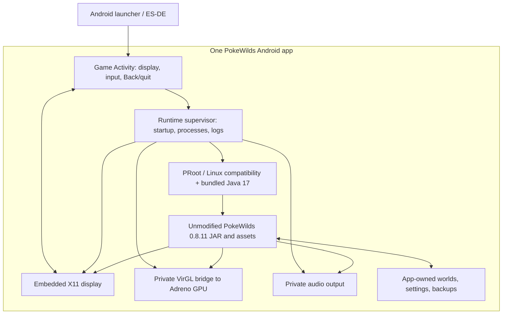

# Standalone PokeWilds 0.8.11 runtime APK

Status: implementation plan only. The current Termux installation remains the working baseline.

## Chosen approach

**Package the existing, unmodified PokeWilds 0.8.11 desktop build together with a private execution environment inside one Android application.** This is the preferred direction for this project, rather than porting the game's source to Android.

The user installs one APK and sees one PokeWilds game. The application handles its own Java runtime, Linux compatibility, display, GPU bridge, audio, files, and clean exit. It may reuse or adapt Termux/PRoot/Termux:X11 components internally, but it must not require any of those apps to be installed separately.

This preserves the exact build we have already tested, including its save behavior and content. The official 0.8.11 release tag does not provide a normal buildable Java/Gradle game project, so this approach also avoids making matching game source a prerequisite. The game JAR remains JVM bytecode; it is not converted into Android DEX or rewritten by R8. See the [source/release audit](research/standalone-source-audit.md).

**The critical feasibility gate is Android runtime packaging:** prove that the selected target SDK can launch this private JVM/Linux stack and embed its display under a new application ID. We cannot simply copy Termux's data directory into an APK and assume it will execute.

## Scope and acceptance criteria

First target: **AYANEO Pocket DMG, Android 13, ARM64, Adreno 740**, installed by sideloading and launched from ES-DE.

The result must:

- Install as one signed APK, with no Termux, Termux:X11, root, USB debugging, package-manager commands, or separately installed runtime.
- Include the game, assets, and runtime payload needed to work offline after installation. A visible, local first-run unpack is acceptable; downloading Ubuntu or Java on the device is not.
- Run the same 0.8.11 JAR and preserve its game/save format.
- Use the working GPU path or a demonstrated equivalent, not the slow softpipe fallback.
- Support the built-in controls, music, save dialogs, and clean exit on the handheld.
- Import an exported copy of the current world's data without touching the existing Termux installation.
- Upgrade the bundled runtime without overwriting saves or settings.

Not part of the first release: a native libGDX game port, new game features, broad phone/touch support, general-purpose terminal access, multiple Linux distributions, or app-store distribution. A different runtime remains an option if the current stack cannot be packaged reliably; changing the game version does not.

## Architecture



This is the target topology, not proof that the existing packages can already be combined. The first implementation spike must validate execution, graphics, and input across the complete path.

### Reuse versus rebuild

| Part | Initial treatment |
| --- | --- |
| Game JAR and assets | Bundle the official 0.8.11 build unchanged; record its checksum and provenance. |
| Game settings and save format | Preserve them. Redirect the process's working directory/data paths rather than rewriting game serialization. |
| Java 17, Linux libraries, Mesa virpipe | Start from the known-good versions; include a pinned private payload. Whether all can remain unchanged depends on the execution proof. |
| PRoot, its loader, Android-side process launchers | Build/package for the new app and its chosen Android execution model. Do not assume writable extracted executables are allowed. |
| Termux:X11 | Reuse/adapt the display/input implementation inside this APK, including its native server and Android surface integration. Remove external-package assumptions. |
| VirGL and audio processes | Bundle app-owned builds with explicit socket paths and lifecycle ownership. Retain GPU acceleration throughout testing. |
| Current shell scripts | Treat as an executable specification of the working setup. Move process ownership and user flows into the app; retain private scripts only if the proven runtime needs them. |
| Current shortcut APK | Replace its Termux intents with an internal runtime supervisor. No `RUN_COMMAND` permission in the standalone APK. |

A single APK can contain several native processes. The requirement is one installation and one managed game session, not one operating-system process.

## Principal risks to resolve first

1. **Executable placement and Android policy.** Android restricts executing code from writable app data for modern target SDKs. Putting PRoot itself in the APK does not automatically make an extracted guest `java`, dynamic linker, and shared libraries usable. Demonstrate the actual launch chain on-device before designing the installer around it.
2. **Hardcoded package/prefix paths.** The current tools use `/data/data/com.termux/files/usr` and separate `com.termux.x11` integration. A standalone app needs its own identity and paths. Inventory compiled-in paths, shebangs, loader locations, socket paths, and package-name references; rebuild or deliberately adapt affected components. Do not impersonate `com.termux` or replace the user's existing Termux installation.
3. **Linux ARM64 is not Android ARM64.** The JAR's Linux native libraries need their Linux/glibc environment. They are not interchangeable with Android/Bionic JNI libraries simply because both are ARM64.
4. **Embedded graphics and dialogs.** Rendering a benchmark is not enough. Test the actual game, its controller behavior, and its AWT/Swing save prompt in the embedded display. Preserve the confirmed `virgl (Adreno (TM) 740)` path; the default LLVMpipe route crashed and softpipe was too slow.
5. **Background/process lifecycle.** Android can stop the app without giving the desktop game a normal close event. We can preserve completed saves and any periodic checkpoints verified in the game; we cannot promise a fresh save on every process death without a proven game-level mechanism.
6. **Payload size and updates.** This will be much larger than the current shortcut APK. Measure the compressed payload, extracted footprint, peak first-install space, and update space before setting a size budget.

See the [platform constraints and primary sources](research/bundled-runtime-requirements.md).

These risks change how we package the runtime, not the decision to preserve 0.8.11.

## Proposed repository layout

Keep the current working installer and shortcut APK available while developing separately:

```text
standalone/
  android-app/             # Activity, display integration, runtime supervisor
  native/                  # Android-side launchers and adapted native components
  runtime/                 # pinned manifest and reproducible payload recipes
  packaging/               # APK assets, checksums, extraction/update logic
  tests/                   # supervisor, payload, migration and device tests
  UPSTREAM.md              # exact component versions, sources and local patches
```

Do not commit a developer's Termux directory, private saves, signing keys, or package caches. Produce the runtime archive from a controlled recipe with explicit inputs. Keep the signing key outside git and use a distinct application ID so the standalone beta can coexist with today's launcher.

## Phase 0 — Freeze the working runtime and define its contract

**Deliverables:** dependency inventory, game checksum, runtime manifest, architecture decision record.

- Capture exact game, JRE, Ubuntu/glibc, Mesa, PRoot, X11, VirGL, and audio versions from the working setup.
- Trace which executables, shared libraries, data files, fonts, and environment variables the game actually needs. Include AWT/Swing, not just the title screen's dependencies.
- Record the working launch environment: display/socket sharing, VirGL driver selection, PulseAudio connection, Java arguments, logical resolution, and working directory.
- Inventory the game's actual save directory and formats. The audit found zipped JSON/Gson saves with a legacy Kryo path; retain the entire world layout, settings, and backups rather than converting a single file.
- Confirm provenance and applicable distribution terms for the game payload and each bundled runtime component. Preserve component notices and source/build references.
- Measure startup time, memory, representative gameplay frame pacing, APK-equivalent payload size, and storage requirements. Use these as the baseline, not a generic graphics benchmark.

**Gate:** a repeatable manifest of what worked, with no dependency on unrecorded state from the user's installation.

## Phase 1 — Prove a self-contained execution and display path

Timebox this as an architecture spike before building a polished app.

1. Create a minimal APK under the proposed new package ID, with an embedded Android display surface and a tiny runtime supervisor.
2. Test Android-native executable/library packaging and the proposed PRoot/guest loader path using a minimal probe, then `java -version`. Use app-owned paths only.
3. Bring up the embedded X11 implementation and the private GPU bridge. Verify the actual renderer, context creation, input delivery, and native process/library loading.
4. Launch the **unchanged 0.8.11 game**. Reach the menu, generate/load a world, play audio, move with the controller, and trigger the game's save-and-exit dialog.
5. Run it with no dependency on installed Termux/X11 packages. A launcher that succeeds only because those apps or files are present fails this gate.

### Choose the execution strategy on evidence

- **Preferred:** an Android-compatible packaging of the private Linux/PRoot/JVM stack, with properly packaged Android-side executables and verified handling of guest execution.
- If modern-target execution is blocked, document the precise failing syscall/path and evaluate a loader adaptation. Do not describe moving the outer binary into `nativeLibraryDir` as a complete fix until guest Java and its libraries actually work.
- An Android-compatible embedded JVM and graphics bridge is another candidate. It still must run this JAR's LWJGL/OpenAL/AWT requirements; a Minecraft-oriented JVM launcher is not automatically a compatible replacement.
- A legacy target-SDK prototype, if considered, is a separate explicit tradeoff for a sideload-only device build. It is not the default shipping plan and must not be used to claim modern Android compatibility.

**Gate:** the actual game and its save dialog run in the new APK. If this fails, produce a concrete blocked-path report and revised runtime choice before proceeding. Obtaining game source is not required for this gate.

## Phase 2 — Build a reproducible, offline runtime payload

- Assemble the pinned runtime on the build machine. There is no `apt`, `pkg`, or distribution download during app startup.
- Separate immutable, versioned runtime/game assets from mutable worlds/settings. Keep guest paths stable even if Android's installation directory changes.
- Package executable code according to the successful Phase 1 model; only extract data/libraries into locations demonstrated to work.
- On first launch, check required free space, unpack to a staging directory, verify a manifest, then atomically mark that runtime version ready. Show progress and allow retry after interruption.
- On update, prepare the new runtime beside the old version. Change the active version only after validation; clean obsolete runtime files without touching user data.
- Begin with a complete proven payload. Trim compiler tools, package caches, documentation, and unused libraries only after dependency and gameplay checks show they are unnecessary.

**Gate:** clean install and interrupted-first-launch recovery work offline; runtime upgrades preserve worlds/settings. Publish measured compressed, extracted, and peak-storage figures.

## Phase 3 — Own the complete process lifecycle

Implement one runtime-supervisor module with a small interface, for example `startOrResume()`, `requestQuit()`, and observable session state. Its implementation owns all process IDs, sockets, logs, and cleanup.

Suggested states: `Preparing → Starting → Running → AwaitingGameExit → Stopped`, with a visible recoverable `Failed` state.

- Enforce one game session during repeated launcher taps and startup races.
- Start the display, GPU bridge, and audio in a defined order; probe readiness instead of relying only on fixed sleeps.
- Start Java with a controlled environment and persistent game working directory.
- Route native Back and a visible Quit control to the tested `WM_DELETE_WINDOW` close request. Present the game's own save prompt in the embedded surface; do not substitute `kill` or destroy its X11 window.
- Keep the display and audio alive until the game has finished saving and exited. Then clean up only processes/sockets owned by that session and return to ES-DE/Android normally.
- Handle launch failure, graphics failure, and hung exit explicitly. A force-stop recovery action must be separate from normal Quit and state the unsaved-progress consequence.
- Define Home/screen-lock behavior through on-device testing. Coordinate focus, audio, and rendering; do not assume the desktop game can be safely paused or forced to save merely by receiving an Android lifecycle callback.
- On process death, recover the last complete saved world/backup on next launch. Verify whether the game provides periodic saving and preserve it where available; do not assume an autosave exists.

**Gate:** start, repeat-start, save/quit, cancelled quit, runtime crash, Home/return, and process-kill recovery all have predictable behavior without orphaned game processes.

## Phase 4 — Saves, settings, and migration

Use Android app-private storage for the new app's data. Present stable paths inside the private runtime so the existing JAR's relative `.sav` directories and settings continue to work unchanged.

1. Add a small export operation to the existing Termux setup that archives a selected world, its related files/backups, and chosen settings. Never move or delete the original.
2. Use Android's document picker to import that archive. The new app cannot directly read Termux's private directory.
3. Validate archive paths, sizes, required files, and version before extraction. Stage imports and handle name collisions explicitly.
4. Launch the imported copy and compare player position, inventory, party, structures, and multiple maps. Save, exit, and reload it.
5. Provide backup export from the standalone app using the system document picker. Keep imports/exports separate from runtime upgrades.
6. Keep the current game format intact. Test both current JSON/Gson saves and any legacy Kryo format we claim to support; do not silently claim all historical saves or mods are compatible.

**Gate:** a copy of the user's saved world works in the standalone APK while the original remains playable in Termux. Uninstalling the standalone app removes private data, so make the export/backup path clear.

## Phase 5 — Handheld and ES-DE integration

- Register a normal Android game Activity with an icon and stable package identity; verify ES-DE's Game importer and repeated launches.
- Reuse the embedded display's proven controller handling, then verify D-pad, stick, A/B, Start, shoulders, held inputs, text entry, and touch interaction with the save dialog.
- Fit the logical viewport to the Pocket DMG with correct aspect ratio and pixel filtering. Keep the efficient rendering resolution configurable without exposing X11 commands.
- Provide a simple first-run experience: prepare bundled files, start game, or import a world. There should be no terminal, Linux package selection, or external-app permission screen.
- Minimize permissions. Remove Termux's `RUN_COMMAND` integration entirely. Prefer app-private IPC; if a component requires loopback networking, document and restrict that use rather than exposing a public service.

**Gate:** install → import in ES-DE → launch → play → save/quit → relaunch requires only the handheld.

## Phase 6 — Release validation

Test a signed release APK, not only a debug build:

- Fresh install with Termux/X11 absent, offline startup, and low-storage/interrupted-extraction recovery.
- At least 30 minutes of representative gameplay, including dense areas, battles, world generation, saving, and audio. Compare the same scene/save and device power mode against the smooth current setup.
- Home/Recents, screen lock, surface recreation, cold process restart, and game crash. Verify the last complete save remains recoverable.
- Repeated launch and quit during startup, save-and-exit confirmation, Cancel, and orderly child-process cleanup.
- Import/export, existing-world compatibility, and same-signing-key APK upgrade without loss of settings or saves.
- APK inspection for all required ARM64 artifacts and no unintended external-package dependencies; verify signature, checksums, and included notices.
- Broader Android versions require their own execution-policy and native-library checks, including 16 KB page-size compatibility where applicable. Passing on Android 13 does not establish universal Android support.

**Release gate:** the game runs smoothly and exits cleanly on the target device from a single installation, with backups and a reproducible build recipe.

## Milestones and effort

1. **M1: Packaging feasibility.** Timebox the first execution/display spike to roughly 2–3 working days of investigation for an experienced developer. Success is either a proven path or a precise account of what must be adapted—not a promise of a complete APK in that time.
2. **M2: Private-runtime prototype.** Exact 0.8.11 game, embedded display, GPU, audio, and save dialog in one APK.
3. **M3: Usable beta.** Offline payload preparation, process supervision, migration, and ES-DE integration.
4. **M4: Signed release candidate.** Lifecycle, upgrade, storage, and sustained-play tests pass.

After M1, estimate from measured rebuild/embedding work. A **multi-week project** is a realistic planning assumption; this is substantially more work than the small Termux-command launcher. Avoid a fixed completion date until the executable/prefix/display questions are settled.

## Immediate next implementation task

Create `standalone/` and prove the **new-package-ID execution chain plus embedded display**, first with `java -version`, then with the unchanged game menu and its save dialog. Record the exact target SDK, executable locations, rebuilt components, and remaining external dependencies.

Do this before polishing menus, rewriting gameplay, shrinking the payload, or removing the working Termux installation.

## Research and references

- [Bundled-runtime constraints](research/bundled-runtime-requirements.md)
- [Runtime component inventory](research/runtime-component-inventory.md)
- [0.8.11 source/release audit](research/standalone-source-audit.md)
- [Android platform and native-port background](research/android-port-requirements.md) — background research; a source port is not the selected approach.
- [Current working launch script](../pokewilds.sh) and [clean-quit helper](../pokewilds-close.c)
